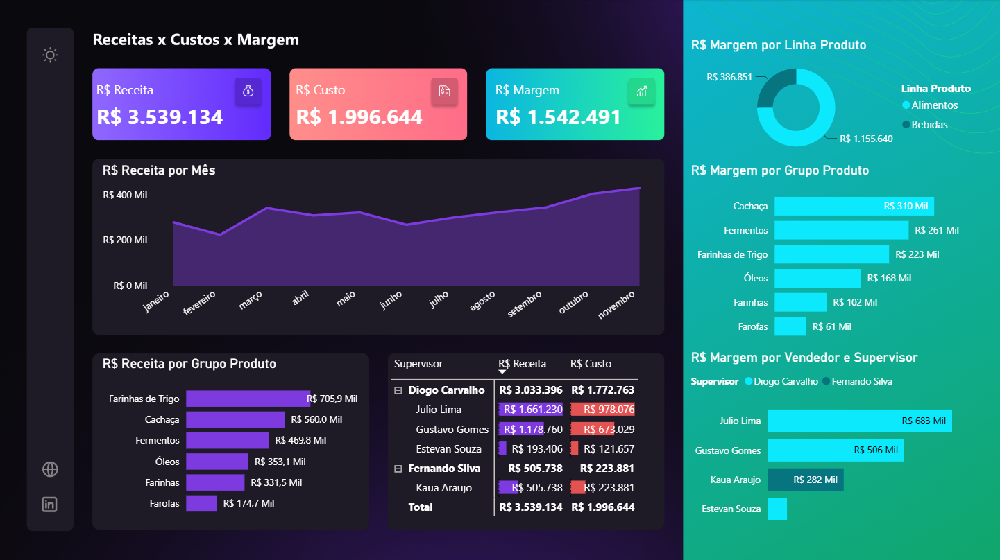
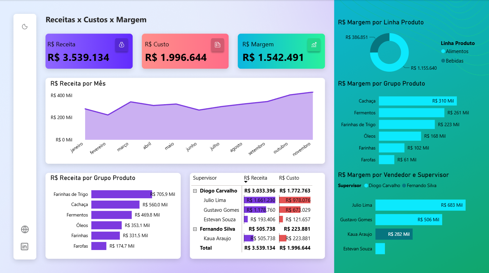

# 📊 Dashboard Financeiro – Power BI

Este projeto consiste em um dashboard desenvolvido no Power BI com foco em análise financeira,
apresentando indicadores-chave de desempenho (KPIs) como Receita, Custo e Margem.

## 🎯 Objetivo
Fornecer uma visão clara e rápida da performance financeira, auxiliando na tomada de decisão
por meio de indicadores visuais e gráficos interativos.

## 🛠️ Ferramentas Utilizadas
- Power BI Desktop
- Modelagem de Dados
- DAX
- Design de Dashboards

## 🎨 Diferenciais do Projeto
- Layout moderno
- Navegação por botões
- Tema claro e escuro

## 📷 Preview do Dashboard

## 📂 Arquivo
O arquivo `.pbix` está disponível neste repositório para download e visualização no Power BI Desktop.
